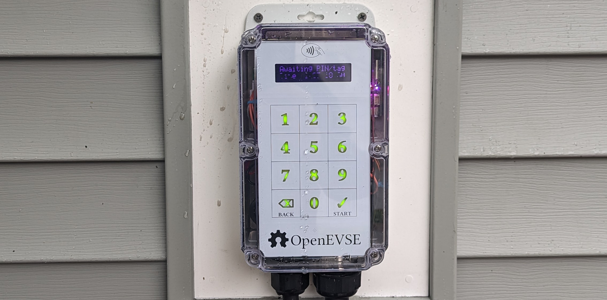
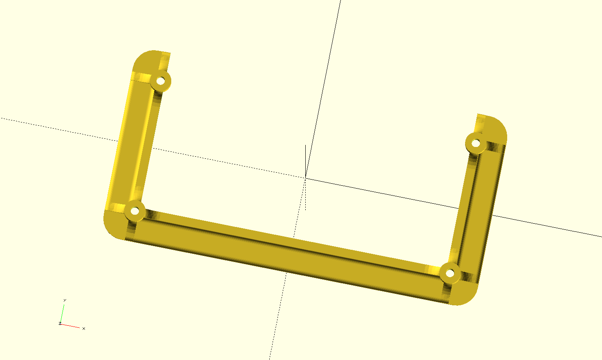

# OpenEVSE Capacitive keypad and RFID reader

Thing tracker at
https://cscott.github.io/thing-tracker/#/thing/c6539aa6-b8c7-4adf-a22c-1baba5bbef97

There is a [Hackaday page for this project].

Discussion in the OpenEVSE forum at
https://openev.freshdesk.com/support/discussions/topics/6000067515

## Description

This repository contains hardware design files for a capacitive
keypad and RFID reader for [OpenEVSE] hardware.

More details can be found on the
[Hackaday page for this project].

 

## Instructions

### Step 1: Purchase components

You will need to purchase a new
[Polycase ML-58 enclosure](https://www.polycase.com/ml-58f), although
the only part we will need from it is the clear front cover.  (Perhaps
we can arrange a special purchase of just the cover if demand
warrants.)

You will also need to purchase or have the Keypad PCB fabricated.  The
KiCad design files are in the [`Keypad-Front`](./Keypad-Front)
subdirectory. It's a four-layer PCB, and I recommend white silkscreen
to avoid heating when in direct sun.  I used 1oz copper on a standard
1.6mm thick PCB.  I found that [JLCPCB](https://jlcpcb.com/) had
very reasonable prices.

I assume you also own an
[OpenEVSE Advanced Series](https://store.openevse.com/collections/all-products)
and have assembled it.

You will also need an LCD mount, which can be 3d printed.  You *might*
be able to reuse the one from your existing OpenEVSE device, but
you'll need to pry the glue off then cut down the top bar. It's
probably easier just to print a new one.

[`lcd-trim-more.stl`]

For compatibility with the latest OpenEVSE web interface, you will
also need to update the firmware on your main OpenEVSE controller
board.  This is out of scope for this guide, but you can find
instructions HERE.  It's a good thing to do between step 3 and 4
when you have your OpenEVSE charger disconnected and open.

### Step 2: Purchase or fabricate I2C cable

You will also need an I2C cable from the OpenEVSE Wifi board.  If you
have the latest-generation WiFi board, this will be a STEMMA-QT cable
(JST-SH, with 1.0mm pitch).  Older boards had an 8-pin JST-PH
connector (2.0mm pitch) and you will have to fabricate an adapter
yourself.

TODO: photos here

### Step 3: Remove cover from OpenEVSE

Unplug your OpenEVSE.  Don't try to do this with your OpenEVSE still
connected to mains power!

Remove the old printed blue cover from your OpenEVSE.  Disconnect
the cable leading from the OpenEVSE main board to the LCD display.

TODO: photo here.

### Step 4: Move the LCD module

Unscrew the LCD module from your old device and screw it onto the new
LCD mount.  You will then need to attach the new LCD mount to the
Keypad PCB, using the silkscreen as a guide.  I found that hot glue
worked well, but other adhesives are probably fine as well.

TODO: photo here

### Step 5: Mount the new PCB

You will now attach the Keypad PCB to the inside of your new clear
ML-58 enclosure cover.  I found that placing the board inside
the cover and then using generous drops of hot glue around the
screw bosses secured the Keypad PCB in a reversible manner, so that I
could still remove it if I needed to later.

TODO: photo here

If you're braver, a clear contact-sensitive adhesive tape (3M
makes a number of different types) would make a more permanent
bond.  Eliminating the air gap between the front cover and the
Keypad PCB is said to yield better performance from capacitive touch
sensors, but the hot-glue method has worked well enough for me.

### Step 5: Connect cables

You will need to connect two cables:

1. The LCD cable that you removed in step 3.

TODO: photo here

2. The I2C cable from step 2, from the OpenEVSE Wifi board to the
STEMMA-QT-compatible ports on the Keypad PCB.

TODO: photo here

### Step 6: Reattach the cover

Screw the cover back on the OpenEVSE!

TODO: photo here

### Step 7: Update OpenEVSE firmware

You'll need to reflash the OpenEVSE to the latest firmware.  The
good news is that you can do this over the web interface!

TODO: instructions here

### Step 8: Add some PINs and cards

TODO: instructions here

### Step 9: Optional improvements

The Keypad PCB also contains an MCP9808 temperature sensor and pads
for a DS3231MZ real-time clock.  Some older versions of the OpenEVSE
hardware contained an MCP9808 daisy-chained from the LCD module and
secured to the front cover.  If your hardware is like this, then
you can use the MCP9808 on the board by connecting the LCD display
to this port on the keypad PCB:

TODO: photo here

You should be able to use your existing cable, but if you have to
purchase or fabricate a new one, it's a STEMMA-QT compatible JST-SH
(1.0mm pitch) on the Keypad PCB side.  On my example, it was JST-PH
(2.0mm pitch) on the LCD side, and you can [buy an appropriate cable
from Adafruit](https://www.adafruit.com/product/4424).

Similarly, *newer* versions of the OpenEVSE hardware omit the
real-time clock which was present on the original OpenEVSE LCD modules.
The justification is that, with ubiquitous network connectivity,
you don't need to pay the steep price (~$10) for a clock chip when
instead you can just ask the network what time it is.

However, if you have intermittent network connectivity at your
installation site, you might want the peace of mind of knowing that
your usage timestamps will always be correct.  Because the RTC chip
is not cheap, it is not populated on the keypad PCB by default,
although all of its support components are present.  You can buy
an appropriate chip ([Digikey part link](https://www.digikey.com/en/products/detail/analog-devices-inc-maxim-integrated/DS3231MZ/2754396))
and battery connector ([Digikey part link](https://www.digikey.com/en/products/detail/mpd-memory-protection-devices/BC-2003-TR/5027929))
and hand-solder them onto the footprints provided.  While you've got
the soldering iron hot, you will most likely want to *remove* the
MCP9808 chip present on the Keypad PCB, since as far as I'm aware
all of the LCD modules *missing* the RTC *also* have the MCP9808
already present on the LCD board.  You don't want two MCP9808s trying
to talk on the same I2C bus.

After adding the RTC, you'd connect the I2C cable from the LCD
module to the Keypad PCB just as done for the MCP9808 above.

## Related

* [OpenEVSE] project
* [Hackaday page for this project]

## License

These designs are licensed under the [CC-BY-SA-4.0] like the original
OpenEVSE designs.

[OpenEVSE]: https://www.openevse.com/
[Hackaday page for this project]: https://hackaday.io/project/194656-openevse-capacitive-keypad-rfid
[`lcd-trim-more.stl`]: ./lcd-trim-more.stl
[CC-BY-SA-4.0]: https://spdx.org/licenses/CC-BY-SA-4.0.html
